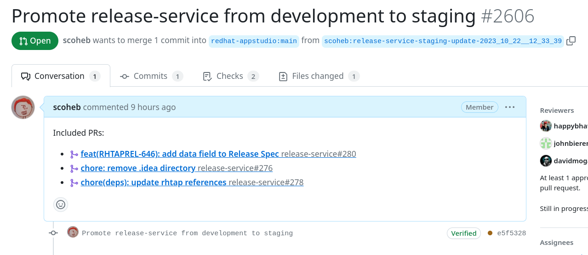
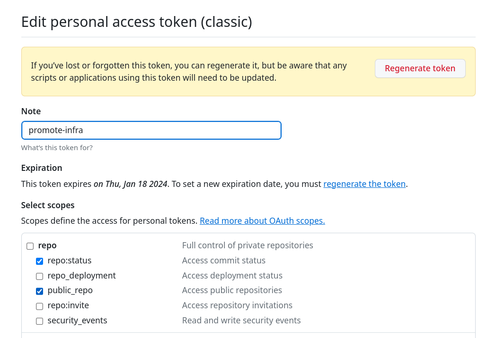

# Promotion of Release Service overlays in the infra-deployments repo

## Introduction

The Release Service in RHTAP is deployed to environments using ArgoCD. The specific content to be deployed to each environment is controlled by overlays.

There are 3 overlays:
- development
- staging
- production

Currently, when a PR is merged in the release-service repo, a PR in the infra-deployments repo is created by a RHTAP release pipeline which updates the **development** overlay. 

Promotion from a lower environment to higher environment is done manually by updating the target overlay.

This script helps to automate this promotion. It analyzes the commits between the source and the target overlays and creates an infra-deployments PR updating the overlay file and includes a changelog.



## Setup

* The script requires an environment variable called _**GITHUB_TOKEN**_ to exist. This token should have the following scopes:



* The script also has 3 required arguments
  * **source-overlay**: Name of the source overlay to promote to target
  * **target-overlay**: Name of the overlay to target for promotion
  * **fork-owner**: Name of the owner of your infra-deployments fork in Github

## Running the script

```
% ./ci/promote-overlay/promote-overlay.sh --source-overlay development  --target-overlay staging --fork-owner scoheb
```

## Example output
```
---
Promoting release-service development to staging in redhat-appstudio/infra-deployments
---

Sync fork with upstream:
This branch is not behind the upstream redhat-appstudio:main.
Cloning into 'infra-deployments'...
remote: Enumerating objects: 21113, done.
remote: Counting objects: 100% (3766/3766), done.
remote: Compressing objects: 100% (430/430), done.
remote: Total 21113 (delta 3391), reused 3417 (delta 3324), pack-reused 17347
Receiving objects: 100% (21113/21113), 3.52 MiB | 3.78 MiB/s, done.
Resolving deltas: 100% (13649/13649), done.
Cloning into 'release-service'...
remote: Enumerating objects: 2995, done.
remote: Counting objects: 100% (801/801), done.
remote: Compressing objects: 100% (287/287), done.
remote: Total 2995 (delta 566), reused 673 (delta 505), pack-reused 2194
Receiving objects: 100% (2995/2995), 30.64 MiB | 4.33 MiB/s, done.
Resolving deltas: 100% (1749/1749), done.
HEAD is now at 2421fc66 release-service update (#2595)
branch 'release-service-staging-update-2023_10_22__12_33_39' set up to track 'origin/main'.
Switched to a new branch 'release-service-staging-update-2023_10_22__12_33_39'

release-service source overlay commit -> 68f2f2c678f726ffa20166adcab8e7e0204a8c69
release-service target overlay commit -> 9a0f08573e4ca3f0d5deda2cbda2575b7e7093bd

Run standard RH pre-commit checks........................................Passed
[release-service-staging-update-2023_10_22__12_33_39 e5f53283] Promote release-service from development to staging
1 file changed, 2 insertions(+), 2 deletions(-)
Enumerating objects: 11, done.
Counting objects: 100% (11/11), done.
Delta compression using up to 16 threads
Compressing objects: 100% (1/1), done.
Writing objects: 100% (6/6), 728 bytes | 728.00 KiB/s, done.
Total 6 (delta 4), reused 5 (delta 4), pack-reused 0
remote: Resolving deltas: 100% (4/4), completed with 4 local objects.
remote:
remote: Create a pull request for 'release-service-staging-update-2023_10_22__12_33_39' on GitHub by visiting:
remote:      https://github.com/scoheb/infra-deployments/pull/new/release-service-staging-update-2023_10_22__12_33_39
remote:
To github.com:scoheb/infra-deployments.git
* [new branch]        release-service-staging-update-2023_10_22__12_33_39 -> release-service-staging-update-2023_10_22__12_33_39

==================================
Pull request created successfully:
- https://github.com/redhat-appstudio/infra-deployments/pull/2606
==================================
```