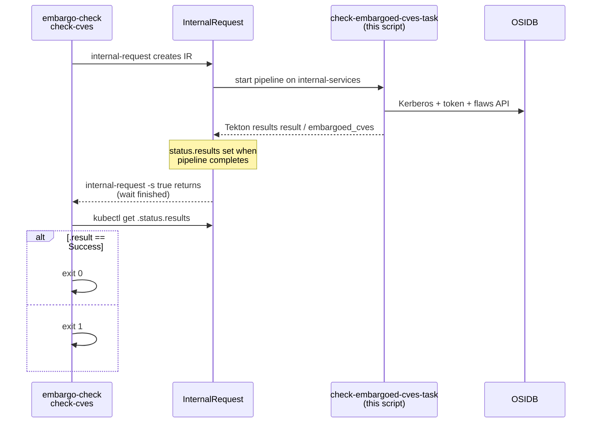

# check_embargoed_cves.py

Checks whether CVEs are safe to mention in public release notes by querying **OSIDB** (Open Security Issue Database).

Source: [`check_embargoed_cves.py`](https://github.com/konflux-ci/release-service-utils/blob/main/scripts/python/tasks/internal/check_embargoed_cves.py)

**Read this first:** The Tekton step almost always **exits 0** even when the check failed. Logical pass/fail is written to Tekton result files (`result`, `embargoed_cves`), which the InternalRequest copies into `status.results`.

---

## How a release triggers this

Catalog task [`embargo-check`](https://github.com/konflux-ci/release-service-catalog/blob/development/tasks/managed/embargo-check/embargo-check.yaml) step **`check-cves`**:

1. Collects CVE ids from `data.json` (see [Which CVEs get checked](#which-cves-get-checked)).
2. Runs `internal-request --pipeline check-embargoed-cves ... -s true`, which **creates** an InternalRequest and **blocks until** the internal pipeline finishes ([`embargo-check.yaml` L308-L318](https://github.com/konflux-ci/release-service-catalog/blob/development/tasks/managed/embargo-check/embargo-check.yaml#L308-L318)).
3. **After** that wait, reads `kubectl get internalrequest <name> -o jsonpath='{.status.results}'` and fails the release if `.result` is not `Success` ([L323-L329](https://github.com/konflux-ci/release-service-catalog/blob/development/tasks/managed/embargo-check/embargo-check.yaml#L323-L329)).

On internal-services, pipeline [`check-embargoed-cves`](https://github.com/konflux-ci/release-service-catalog/blob/development/pipelines/internal/check-embargoed-cves/check-embargoed-cves.yaml) runs [`check-embargoed-cves-task`](https://github.com/konflux-ci/release-service-catalog/blob/development/tasks/internal/check-embargoed-cves-task/check-embargoed-cves-task.yaml), which executes this script.



`status.results` does **not** exist for a useful read until the InternalRequest pipeline has **finished**. `check-cves` only reads it **after** `internal-request` returns.

### Which CVEs get checked

[`check-cves`](https://github.com/konflux-ci/release-service-catalog/blob/development/tasks/managed/embargo-check/embargo-check.yaml#L285-L298) builds the `--cves` list only from:

- `releaseNotes.content.images[].cves.fixed`, or
- `releaseNotes.content.artifacts[].cves.fixed`

If the list is empty, it logs **`No CVEs found to check`** and exits 0 — this script never runs.

The InternalRequest name appears in `check-cves` logs as `done (<name>)`. That object’s `status.results` holds the same `result` and `embargoed_cves` values the script wrote on internal-services:

```bash
kubectl get internalrequest "<name>" -o jsonpath='{.status.results}'
```

`check-cves` prints **`The following CVEs are marked as embargoed:`** whenever `.result` is not `Success`, then prints `.embargoed_cves` — even when that field is **empty** (for example Kerberos or OSIDB errors). Read the full `.result` string, not the banner alone.

---

## Pass / fail rule (OSIDB response)

For each CVE, only the **first** flaw in the list response matters ([`is_embargoed_flaw_response`](https://github.com/konflux-ci/release-service-utils/blob/main/scripts/python/tasks/internal/check_embargoed_cves.py#L50-L67)):

| `results[0].embargoed` | Meaning |
|------------------------|---------|
| JSON `false` | OK for public release notes |
| `true`, `null`, missing key, non-dict row, empty `results`, empty HTTP body → `{}` | Counts as embargoed or not visible to the service account |

---

## What each part of the code does

The file has three layers: small helpers, [`run_check`](https://github.com/konflux-ci/release-service-utils/blob/main/scripts/python/tasks/internal/check_embargoed_cves.py#L137-L234) (core work), and [`main`](https://github.com/konflux-ci/release-service-utils/blob/main/scripts/python/tasks/internal/check_embargoed_cves.py#L237-L297) (CLI + Tekton results).

### CLI: [`parse_args`](https://github.com/konflux-ci/release-service-utils/blob/main/scripts/python/tasks/internal/check_embargoed_cves.py#L115-L134) and [`parse_cve_list`](https://github.com/konflux-ci/release-service-utils/blob/main/scripts/python/tasks/internal/check_embargoed_cves.py#L45-L47)

Tekton passes a fixed argv: `--cves "CVE-1 CVE-2"`.

- [`parse_args`](https://github.com/konflux-ci/release-service-utils/blob/main/scripts/python/tasks/internal/check_embargoed_cves.py#L124-L134): requires `--cves` non-blank; `-h` / missing cves print usage to stderr and exit 1. Extra arguments are rejected (argparse exit 2) — not seen in production Tekton.
- [`parse_cve_list`](https://github.com/konflux-ci/release-service-utils/blob/main/scripts/python/tasks/internal/check_embargoed_cves.py#L45-L47): strips the string and splits on whitespace into a list of ids.

If parsing yields no ids, [`main`](https://github.com/konflux-ci/release-service-utils/blob/main/scripts/python/tasks/internal/check_embargoed_cves.py#L257-L259) returns 1 **before** writing Tekton results (only misconfiguration / manual runs).

### Tekton paths: [`main`](https://github.com/konflux-ci/release-service-utils/blob/main/scripts/python/tasks/internal/check_embargoed_cves.py#L261-L270) start

- [`tekton.result_paths_from_env`](https://github.com/konflux-ci/release-service-utils/blob/main/scripts/python/helpers/tekton.py#L149-L175): reads `RESULT_RESULT` and `RESULT_EMBARGOED_CVES` env vars (set in [task YAML L66-L69](https://github.com/konflux-ci/release-service-catalog/blob/development/tasks/internal/check-embargoed-cves-task/check-embargoed-cves-task.yaml#L66-L69)) as filesystem paths.
- Clears [`embargoed_cves`](https://github.com/konflux-ci/release-service-utils/blob/main/scripts/python/tasks/internal/check_embargoed_cves.py#L264) immediately so a mid-run crash does not leave stale CVE ids.
- [`file.path_from_env_variable`](https://github.com/konflux-ci/release-service-utils/blob/main/scripts/python/tasks/internal/check_embargoed_cves.py#L268-L270): mount directory, default `/mnt/osidb-service-account` (override `OSIDB_SERVICE_ACCOUNT_MOUNT` in tests only).

Program name in messages is the basename of argv[0] ([`check_embargoed_cves.py`](https://github.com/konflux-ci/release-service-utils/blob/main/scripts/python/tasks/internal/check_embargoed_cves.py#L267-L267)), matching Tekton logs.

### Mount and Kerberos: [`run_check`](https://github.com/konflux-ci/release-service-utils/blob/main/scripts/python/tasks/internal/check_embargoed_cves.py#L160-L200) start

**Load secret files** ([L163-L172](https://github.com/konflux-ci/release-service-utils/blob/main/scripts/python/tasks/internal/check_embargoed_cves.py#L163-L172)):

[`authentication.load_service_account`](https://github.com/konflux-ci/release-service-utils/blob/main/scripts/python/helpers/authentication.py#L46-L68) reads:

| File under mount | Use |
|------------------|-----|
| `name` | Kerberos principal |
| `base64_keytab` | Base64 keytab → decoded bytes |
| `osidb_url` | Base URL for `/auth/token` and `/osidb/api/v2/flaws` |

Failures → [`CheckStepError` “reading the mounted OSIDB service account”](https://github.com/konflux-ci/release-service-utils/blob/main/scripts/python/tasks/internal/check_embargoed_cves.py#L170-L171).

**Temp credentials** ([L174-L187](https://github.com/konflux-ci/release-service-utils/blob/main/scripts/python/tasks/internal/check_embargoed_cves.py#L174-L187)):

- Write keytab bytes to a temp file ([`file.make_tempfile_path`](https://github.com/konflux-ci/release-service-utils/blob/main/scripts/python/tasks/internal/check_embargoed_cves.py#L175)).
- Create an empty credential cache file for `KRB5CCNAME`.
- Copy [`/etc/krb5.conf`](https://github.com/konflux-ci/release-service-utils/blob/main/scripts/python/tasks/internal/check_embargoed_cves.py#L182) to a temp file and [`patch_krb5_config`](https://github.com/konflux-ci/release-service-utils/blob/main/scripts/python/helpers/authentication.py#L71-L89) (adds `dns_canonicalize_hostname = false` under `[libdefaults]` for container kinit).

**kinit** ([L189-L200](https://github.com/konflux-ci/release-service-utils/blob/main/scripts/python/tasks/internal/check_embargoed_cves.py#L189-L200)):

[`authentication.kinit_with_retry`](https://github.com/konflux-ci/release-service-utils/blob/main/scripts/python/helpers/authentication.py#L92-L120) runs `kinit -k -t <temp-keytab>` up to 5 times with backoff. The keytab bytes came from the secret mount on this run — there is no older ticket to refresh. Failure → `Failed while logging in with Kerberos (kinit): …` (see [Troubleshooting → Stale or expired Kerberos credentials](#stale-or-expired-kerberos-credentials)).

Then [`os.environ.update(kenv)`](https://github.com/konflux-ci/release-service-utils/blob/main/scripts/python/tasks/internal/check_embargoed_cves.py#L200) so later HTTP calls in **this process** see the same `KRB5CCNAME` / `KRB5_CONFIG` (kinit only set env on the child).

[`finally` L231-L234](https://github.com/konflux-ci/release-service-utils/blob/main/scripts/python/tasks/internal/check_embargoed_cves.py#L231-L234): delete temp keytab, ccache, and krb5 config even on error.

### Per-CVE loop: [`run_check`](https://github.com/konflux-ci/release-service-utils/blob/main/scripts/python/tasks/internal/check_embargoed_cves.py#L204-L230)

For **each** CVE id (order preserved):

1. **Log** [`Checking CVE {cve}`](https://github.com/konflux-ci/release-service-utils/blob/main/scripts/python/tasks/internal/check_embargoed_cves.py#L206) (stdout).

2. **Token** ([L207-L212](https://github.com/konflux-ci/release-service-utils/blob/main/scripts/python/tasks/internal/check_embargoed_cves.py#L207-L212)): [`osidb.get_access_token`](https://github.com/konflux-ci/release-service-utils/blob/main/scripts/python/helpers/osidb.py#L23-L45) GET `{osidb_url}/auth/token` with [`HTTPKerberosAuth`](https://github.com/konflux-ci/release-service-utils/blob/main/scripts/python/helpers/osidb.py#L33-L35) (SPNEGO from the kinit cache). Parses JSON field `access` for the bearer string. A **new token per CVE** avoids expiry mid-loop.

   Failures → `Failed while getting an OSIDB access token (HTTP request): …` (includes OSIDB auth down/unreachable).

3. **Flaws** ([L213-L224](https://github.com/konflux-ci/release-service-utils/blob/main/scripts/python/tasks/internal/check_embargoed_cves.py#L213-L224)): [`fetch_flaw_state`](https://github.com/konflux-ci/release-service-utils/blob/main/scripts/python/tasks/internal/check_embargoed_cves.py#L85-L104) GET  
   `{osidb_url}/osidb/api/v2/flaws?cve_id=…&include_fields=cve_id,embargoed`  
   with `Authorization: Bearer {token}` via [`http_client.get_text`](https://github.com/konflux-ci/release-service-utils/blob/main/scripts/python/helpers/http_client.py#L61-L111).

   Failures → `Failed while querying the OSIDB flaws API (HTTP request): …` (includes OSIDB API down/unreachable).

4. **Decide** ([L225-L227](https://github.com/konflux-ci/release-service-utils/blob/main/scripts/python/tasks/internal/check_embargoed_cves.py#L225-L227)): [`is_embargoed_flaw_response(data)`](https://github.com/konflux-ci/release-service-utils/blob/main/scripts/python/tasks/internal/check_embargoed_cves.py#L50-L67). If true, log [`CVE {cve} is embargoed`](https://github.com/konflux-ci/release-service-utils/blob/main/scripts/python/tasks/internal/check_embargoed_cves.py#L226) and append to `found`.

Returns [`(found, 0 or 1)`](https://github.com/konflux-ci/release-service-utils/blob/main/scripts/python/tasks/internal/check_embargoed_cves.py#L229-L230): second value is logical failure if any CVE was flagged.

### Result text helpers

- [`_embargo_finding_result_text`](https://github.com/konflux-ci/release-service-utils/blob/main/scripts/python/tasks/internal/check_embargoed_cves.py#L70-L82): policy message when the loop finished but `found` is non-empty.
- [`tekton.write_failure_result`](https://github.com/konflux-ci/release-service-utils/blob/main/scripts/python/helpers/tekton.py#L66-L101): formats `Failed while {action}: {cause}.` for [`CheckStepError`](https://github.com/konflux-ci/release-service-utils/blob/main/scripts/python/helpers/tekton.py#L19-L31).

### Write results: [`main`](https://github.com/konflux-ci/release-service-utils/blob/main/scripts/python/tasks/internal/check_embargoed_cves.py#L274-L297) end

| Situation | `result` | `embargoed_cves` |
|-----------|----------|------------------|
| `out_rc == 0` | [`Success`](https://github.com/konflux-ci/release-service-utils/blob/main/scripts/python/tasks/internal/check_embargoed_cves.py#L287-L288) | empty (spaces-only write from empty `found`) |
| Loop flagged CVEs (`problem` non-empty) | [`_embargo_finding_result_text`](https://github.com/konflux-ci/release-service-utils/blob/main/scripts/python/tasks/internal/check_embargoed_cves.py#L289-L291) | each id + trailing space ([L286](https://github.com/konflux-ci/release-service-utils/blob/main/scripts/python/tasks/internal/check_embargoed_cves.py#L286)) |
| `CheckStepError` or other exception | [`write_failure_result`](https://github.com/konflux-ci/release-service-utils/blob/main/scripts/python/tasks/internal/check_embargoed_cves.py#L292-L295) | stays empty |

Unexpected exceptions are wrapped as [`CheckStepError("running the check", …)`](https://github.com/konflux-ci/release-service-utils/blob/main/scripts/python/tasks/internal/check_embargoed_cves.py#L280-L284).

Always [`return 0`](https://github.com/konflux-ci/release-service-utils/blob/main/scripts/python/tasks/internal/check_embargoed_cves.py#L297) so Tekton publishes results ([catalog task description](https://github.com/konflux-ci/release-service-catalog/blob/development/tasks/internal/check-embargoed-cves-task/check-embargoed-cves-task.yaml#L11-L15)).

### Stdout vs results

| Output channel | Success | Policy fail | OSIDB / kinit fail |
|----------------|---------|-------------|-------------------|
| Step stdout | `Checking CVE …` only | + `CVE … is embargoed` | often last `Checking CVE …` then failure in `result` |
| Tekton `result` | `Success` | `check failed: … not clearly public…` | `Failed while …` |
| Tekton `embargoed_cves` | empty | CVE ids | empty |

There is no `Success` line on stdout.

---

## Troubleshooting

Compare the internal `check-embargoed-cves-task` step log with `kubectl get internalrequest <name> -o jsonpath='{.status.results}'`. If `internal-request` never completed, inspect the InternalRequest status first — `status.results` may be missing or stale.

### Stale or expired Kerberos credentials

The secret does **not** supply a Kerberos ticket to reuse. It supplies a **keytab** (`base64_keytab`) and principal (`name`). Every run builds a **new** temp credential cache and runs [`kinit`](https://github.com/konflux-ci/release-service-utils/blob/main/scripts/python/tasks/internal/check_embargoed_cves.py#L194-L197) against that keytab ([`kinit_with_retry`](https://github.com/konflux-ci/release-service-utils/blob/main/scripts/python/helpers/authentication.py#L92-L125), up to 5 attempts with backoff).

#### Expired or rotated keytab in `osidb-service-account`

If the key material in the secret is expired, revoked, or does not match `name` (common when the cert/keytab was rotated but the secret was not updated), **`kinit` never succeeds**. The script never reaches `Checking CVE …` lines.

| What you see | Meaning |
|--------------|---------|
| Internal TaskRun log | No `Checking CVE` lines |
| `status.results.result` | `check_embargoed_cves.py: Failed while logging in with Kerberos (kinit): …` |
| `status.results.embargoed_cves` | empty |

The text after the colon is often a generic non-zero exit from `kinit` (the result line does not usually say “expired” explicitly). Retries do not help if the mounted keytab is wrong.

**Fix:** Update secret `osidb-service-account` on internal-services with a current keytab and matching principal, then re-run.

#### Ticket lifetime during the CVE loop

After a successful `kinit`, the ticket lives in the temp cache for the rest of the run ([`KRB5CCNAME`](https://github.com/konflux-ci/release-service-utils/blob/main/scripts/python/tasks/internal/check_embargoed_cves.py#L190-L200)). Each CVE calls [`get_access_token`](https://github.com/konflux-ci/release-service-utils/blob/main/scripts/python/helpers/osidb.py#L23-L45) again (SPNEGO from that cache). A normal run finishes well inside typical ticket lifetime.

If the ticket **does** expire mid-run (very long CVE list plus a short ticket lifetime), the first affected CVE usually fails at the **token** step, not at `kinit`:

| What you see | Meaning |
|--------------|---------|
| Log | `Checking CVE …` for some ids, then failure on a later id |
| `status.results.result` | `Failed while getting an OSIDB access token (HTTP request): …` (often 401 or negotiate failure) |
| `embargoed_cves` | empty |

That is still credential-related: refresh the keytab in the secret or investigate KDC ticket policy — not an embargoed CVE.

### OSIDB down, slow, or unreachable

This is **not** the same as “CVE is embargoed.”

#### Hard failures (outage / network / HTTP errors)

When OSIDB (or the path to it) is down, the script usually stops in the **token** or **flaws** step and writes a `result` line like:

- `Failed while getting an OSIDB access token (HTTP request): …`
- `Failed while querying the OSIDB flaws API (HTTP request): …`

The tail after the colon comes from [`requests`](https://github.com/konflux-ci/release-service-utils/blob/main/scripts/python/tasks/internal/check_embargoed_cves.py#L209-L224) / [`http_client.get_text`](https://github.com/konflux-ci/release-service-utils/blob/main/scripts/python/helpers/http_client.py#L61-L111): connection refused, DNS failure, TLS errors, timeouts, or non-2xx after retries. Examples you may see in `.result`: `Connection refused`, `Read timed out`, `503 Server Error`, `502 Bad Gateway`.

[`http_client`](https://github.com/konflux-ci/release-service-utils/blob/main/scripts/python/helpers/http_client.py#L26-L37) retries GETs on **500, 502, 503, 504** (up to 3 times per urllib3 policy) and on **429** (up to 5 attempts with backoff). A sustained outage still fails after those retries.

Each GET uses a **60 second** timeout ([`http_client.get_text` L66](https://github.com/konflux-ci/release-service-utils/blob/main/scripts/python/helpers/http_client.py#L66)). A hung OSIDB can leave the last log line at [`Checking CVE …`](https://github.com/konflux-ci/release-service-utils/blob/main/scripts/python/tasks/internal/check_embargoed_cves.py#L206) until that timeout fires.

For these failures, **`embargoed_cves` is empty**. Do not treat the parent banner as a CVE list.

**Checks:** OSIDB health, network from internal-services, `osidb_url` in secret `osidb-service-account`, Kerberos still valid (token step needs a working cache after `kinit`).

#### InternalRequest timeout (OSIDB never reached)

If `internal-request` fails or times out **before** the pipeline completes, `check-cves` may fail **without** a useful `status.results` from this script ([`embargo-check` IR failure tests](https://github.com/konflux-ci/release-service-catalog/blob/development/tasks/managed/embargo-check/tests/test-embargo-check-ir-failure.yaml)). That is a wait/orchestration problem (timeout param `requestTimeout`, internal pipeline stuck), not the embargo result strings below.

#### Looks like outage but is policy (OSIDB up, empty body)

If flaws GET returns **HTTP 200 with an empty body**, [`fetch_flaw_state`](https://github.com/konflux-ci/release-service-utils/blob/main/scripts/python/tasks/internal/check_embargoed_cves.py#L102-L104) returns `{}`, and [`is_embargoed_flaw_response`](https://github.com/konflux-ci/release-service-utils/blob/main/scripts/python/tasks/internal/check_embargoed_cves.py#L58-L60) treats the CVE as **not clearly public** — log line [`CVE … is embargoed`](https://github.com/konflux-ci/release-service-utils/blob/main/scripts/python/tasks/internal/check_embargoed_cves.py#L226-L227), populated `embargoed_cves`, and the `check failed: … not clearly public` result text.

OSIDB can be “up” while the service account still sees no public flaw row. That is **not** `Failed while querying…` unless HTTP/JSON actually failed.

### By last step log line

| Last log line | Likely issue | What to check |
|---------------|--------------|---------------|
| (no `Checking CVE` lines) | Failed before the loop — mount, krb5, or kinit | `result` for `reading the mounted OSIDB service account`, `reading the Kerberos configuration`, or `logging in with Kerberos (kinit)` — often [expired keytab in secret](#expired-or-rotated-keytab-in-osidb-service-account); secret `osidb-service-account` on internal-services |
| `Checking CVE X` then failure, no `is embargoed` for X | OSIDB auth or API error on that CVE | `result` for `getting an OSIDB access token` or `querying the OSIDB flaws API`; OSIDB uptime; error tail (timeout, 503, connection refused) |
| `Checking CVE X` then `CVE X is embargoed` | Policy / visibility, not a transport error | `embargoed_cves` and `check failed: … not clearly public`; flaw visible to service account in OSIDB (`embargoed: false`) |
| `Checking CVE X` for last id, no further lines for a long time | Hung until HTTP timeout | 60s per GET; OSIDB slowness; then `Failed while …` in `result` |
| `CVE … is embargoed` lines then failed release | Expected when those CVEs are not public in OSIDB | Confirm OSIDB data for listed ids |

### By `status.results.result`

| `.result` pattern | `.embargoed_cves` | Likely issue |
|-------------------|-------------------|--------------|
| `Success` | empty | All CVEs clearly public in OSIDB |
| `check failed` + `not clearly public in OSIDB` | lists ids | Embargo or no public flaw row for service account — see [pass/fail rule](#pass--fail-rule-osidb-response) |
| `Failed while reading the mounted OSIDB service account` | empty | Missing/wrong files under `/mnt/osidb-service-account` |
| `Failed while reading the Kerberos configuration` | empty | `/etc/krb5.conf` not readable in image |
| `Failed while logging in with Kerberos (kinit)` | empty | Bad or [expired keytab / wrong principal](#expired-or-rotated-keytab-in-osidb-service-account) in `osidb-service-account`; realm/clock |
| `Failed while getting an OSIDB access token` | empty | OSIDB auth down, SPNEGO failure, or [ticket expired mid-run](#ticket-lifetime-during-the-cve-loop) — [OSIDB down](#osidb-down-slow-or-unreachable) |
| `Failed while querying the OSIDB flaws API` | empty | Flaws endpoint error after retries — [OSIDB down](#osidb-down-slow-or-unreachable) |
| `Failed while running the check` | empty | Unexpected bug — capture log + `.result`, file issue against release-service-utils |

### `embargo-check` messages outside this script

| Log | Meaning |
|-----|---------|
| `No CVEs found to check` | No `cves.fixed` in release notes — script not invoked |
| `No data JSON was provided.` | `data.json` path problem in `embargo-check` |
| `The following CVEs are marked as embargoed:` | `.result` ≠ `Success` — inspect `.result` and `.embargoed_cves`; empty list after banner often means [OSIDB down](#osidb-down-slow-or-unreachable), not embargo |

Jira / releaseNotes structure failures are other `embargo-check` steps, not this script.

---

## Tests and related catalog files

| Item | Link |
|------|------|
| Unit tests | [`test_check_embargoed_cves.py`](https://github.com/konflux-ci/release-service-utils/blob/main/scripts/python/tasks/internal/test_check_embargoed_cves.py) |
| Catalog task test | [`test-check-embargoed-cves-task`](https://github.com/konflux-ci/release-service-catalog/blob/development/tasks/internal/check-embargoed-cves-task/tests/test-check-embargoed-cves-task.yaml) |
| Helper modules | [`authentication`](https://github.com/konflux-ci/release-service-utils/blob/main/scripts/python/helpers/authentication.py), [`osidb`](https://github.com/konflux-ci/release-service-utils/blob/main/scripts/python/helpers/osidb.py), [`http_client`](https://github.com/konflux-ci/release-service-utils/blob/main/scripts/python/helpers/http_client.py), [`tekton`](https://github.com/konflux-ci/release-service-utils/blob/main/scripts/python/helpers/tekton.py) |
