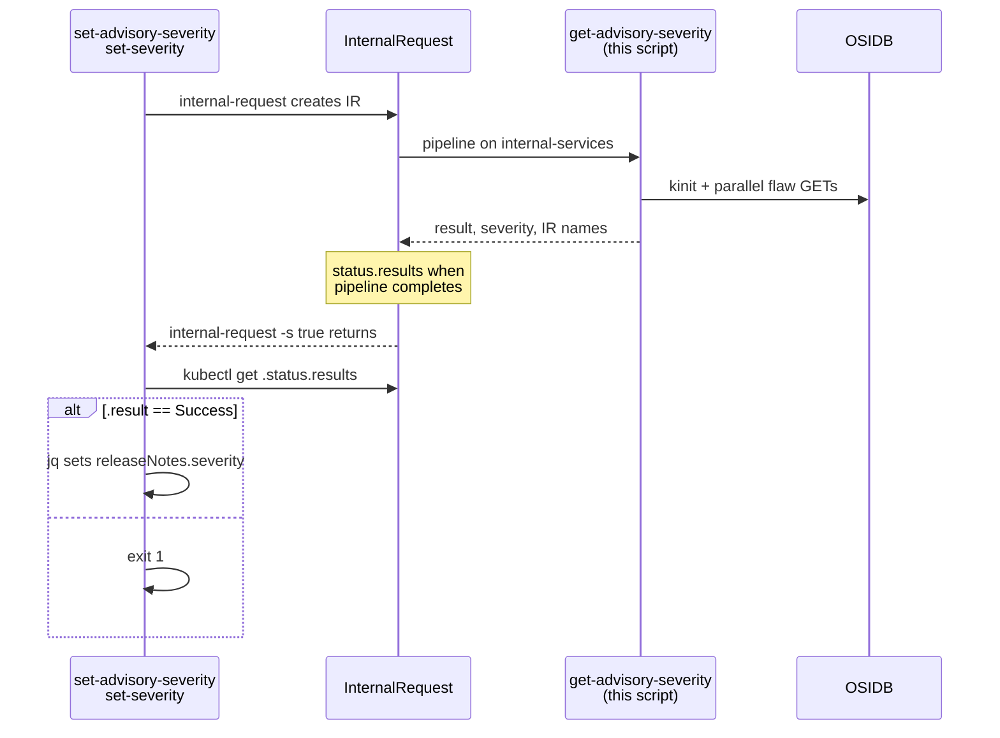

# get_advisory_severity.py

Computes the **highest advisory severity** for an RHSA by querying OSIDB for every fixed CVE on each release-note image, then writing a title-cased level (e.g. `Critical`) to Tekton results.

Source: [`get_advisory_severity.py`](https://github.com/konflux-ci/release-service-utils/blob/main/scripts/python/tasks/internal/get_advisory_severity.py)

**Read this first:** On a normal Tekton run with all env vars set, the process **returns 0** even when severity lookup failed. Pass/fail is in **`result`**; the severity string is in **`severity`**. If required env vars are missing, [`main`](https://github.com/konflux-ci/release-service-utils/blob/main/scripts/python/tasks/internal/get_advisory_severity.py#L383-L414) prints to stderr and exits **1** before writing results.

Logs go to **stderr** as `INFO:` / `WARNING:` lines ([`logger`](https://github.com/konflux-ci/release-service-utils/blob/main/scripts/python/helpers/logger.py)).

---

## How a release triggers this

Catalog task [`set-advisory-severity`](https://github.com/konflux-ci/release-service-catalog/blob/development/tasks/managed/set-advisory-severity/set-advisory-severity.yaml) step **`set-severity`**:

1. Reads `data.json`. **Skips** the internal check when:
   - `releaseNotes.type` is not `RHSA` ([L136-L142](https://github.com/konflux-ci/release-service-catalog/blob/development/tasks/managed/set-advisory-severity/set-advisory-severity.yaml#L136-L142))
   - `releaseNotes.content.artifacts` is non-empty ([L164-L167](https://github.com/konflux-ci/release-service-catalog/blob/development/tasks/managed/set-advisory-severity/set-advisory-severity.yaml#L164-L167))
2. For RHSA with **images only**, builds `releaseNotesImages`: `jq -c '.releaseNotes.content.images' | gzip | base64` ([L169](https://github.com/konflux-ci/release-service-catalog/blob/development/tasks/managed/set-advisory-severity/set-advisory-severity.yaml#L169)).
3. Runs `internal-request --pipeline get-advisory-severity ... -s true` and **waits** for the internal pipeline ([L174-L184](https://github.com/konflux-ci/release-service-catalog/blob/development/tasks/managed/set-advisory-severity/set-advisory-severity.yaml#L174-L184)).
4. **After** the wait, reads `status.results`. On `result == Success`, sets `releaseNotes.severity` from `.severity` ([L189-L200](https://github.com/konflux-ci/release-service-catalog/blob/development/tasks/managed/set-advisory-severity/set-advisory-severity.yaml#L189-L200)).

On internal-services, pipeline [`get-advisory-severity`](https://github.com/konflux-ci/release-service-catalog/blob/development/pipelines/internal/get-advisory-severity/get-advisory-severity.yaml) runs catalog task [`get-advisory-severity`](https://github.com/konflux-ci/release-service-catalog/blob/development/tasks/internal/get-advisory-severity/get-advisory-severity.yaml). That task should invoke this Python script with the env vars in [Tekton env (Python step)](#tekton-env-python-step).



`status.results` is only meaningful **after** `internal-request` returns. InternalRequest name: `done (<name>)` in `set-severity` logs.

```bash
kubectl get internalrequest "<name>" -o jsonpath='{.status.results}'
```

On failure, `set-severity` logs **`The InternalRequest to find the severity was unsuccessful`** and prints `.result` — read that string, not only the banner.

### Tekton env (Python step)

When the catalog step runs this script (same contract as [`get-advisory-severity` results](https://github.com/konflux-ci/release-service-catalog/blob/development/tasks/internal/get-advisory-severity/get-advisory-severity.yaml#L30-L38)):

| Env var | Source |
|---------|--------|
| `IMAGES_ENCODED` | `$(params.releaseNotesImages)` |
| `RESULT_RESULT` | `$(results.result.path)` |
| `RESULT_SEVERITY` | `$(results.severity.path)` |
| `RESULT_INTERNAL_REQUEST_PIPELINE_RUN_NAME` | `$(results.internalRequestPipelineRunName.path)` |
| `RESULT_INTERNAL_REQUEST_TASK_RUN_NAME` | `$(results.internalRequestTaskRunName.path)` |
| `PARAM_INTERNAL_REQUEST_PIPELINE_RUN_NAME` | `$(params.internalRequestPipelineRunName)` |
| `PARAM_TASK_RUN_NAME` | `$(context.taskRun.name)` |
| OSIDB mount | `/mnt/osidb-service-account` (secret `osidb-service-account`) |

[`internal_request_results.write_result_paths`](https://github.com/konflux-ci/release-service-utils/blob/main/scripts/python/helpers/internal_request_results.py#L9-L21) writes the pipeline and task run names at the start of [`run_get_advisory_severity`](https://github.com/konflux-ci/release-service-utils/blob/main/scripts/python/tasks/internal/get_advisory_severity.py#L310-L314).

---

## Severity rules

Constants: [`_SEVERITY_LEVELS`](https://github.com/konflux-ci/release-service-utils/blob/main/scripts/python/tasks/internal/get_advisory_severity.py#L42-L43) — `CRITICAL`, `IMPORTANT`, `MODERATE`, `LOW` (order = rank).

For each **image** and each **fixed CVE** on that image:

1. Load flaw JSON from the parallel fetch cache.
2. [`resolve_impact_for_repository`](https://github.com/konflux-ci/release-service-utils/blob/main/scripts/python/tasks/internal/get_advisory_severity.py#L116-L134): start with flaw-level `impact`; if [`find_matching_purl`](https://github.com/konflux-ci/release-service-utils/blob/main/utils/find_matching_purl.py) finds a row in `affects` whose `purl` matches `image.repository`, use that row’s `impact` when non-empty.
3. [`higher_severity`](https://github.com/konflux-ci/release-service-utils/blob/main/scripts/python/tasks/internal/get_advisory_severity.py#L81-L88) keeps the maximum across all image/CVE pairs.

Output: [`run_get_advisory_severity`](https://github.com/konflux-ci/release-service-utils/blob/main/scripts/python/tasks/internal/get_advisory_severity.py#L358-L359) writes `highest.lower().capitalize()` to `severity` (e.g. `CRITICAL` → `Critical`) and `Success` to `result`.

If nothing yields a known level, [`CheckStepError`](https://github.com/konflux-ci/release-service-utils/blob/main/scripts/python/tasks/internal/get_advisory_severity.py#L369-L373) with message [`_NO_SEVERITY_MSG`](https://github.com/konflux-ci/release-service-utils/blob/main/scripts/python/tasks/internal/get_advisory_severity.py#L43): `Unable to find severity on any cve listed in the releaseNotes`.

---

## What each part of the code does

### Input: [`decode_release_notes_images`](https://github.com/konflux-ci/release-service-utils/blob/main/scripts/python/tasks/internal/get_advisory_severity.py#L47-L58)

Decodes `IMAGES_ENCODED`: base64 → gzip decompress (max [`32 MiB`](https://github.com/konflux-ci/release-service-utils/blob/main/scripts/python/tasks/internal/get_advisory_severity.py#L44-L53) decompressed) → JSON **array** of image dicts. Wrong shape raises `ValueError`.

### CVE list: [`unique_fixed_cves`](https://github.com/konflux-ci/release-service-utils/blob/main/scripts/python/tasks/internal/get_advisory_severity.py#L61-L78)

Walks each image’s `cves.fixed` keys; returns unique ids in first-seen order. Images without `cves.fixed` contribute nothing.

### OSIDB fetch: [`fetch_flaw_record`](https://github.com/konflux-ci/release-service-utils/blob/main/scripts/python/tasks/internal/get_advisory_severity.py#L137-L162)

GET `{osidb_url}/osidb/api/v2/flaws?cve_id=…&include_fields=cve_id,impact,affects.purl,affects.impact` ([`_FLAW_INCLUDE_FIELDS`](https://github.com/konflux-ci/release-service-utils/blob/main/scripts/python/tasks/internal/get_advisory_severity.py#L39)).

Requires non-empty body and `results[0]` dict; otherwise `ValueError` (`empty OSIDB response`, `no OSIDB flaw row`, etc.).

### Token retry: [`fetch_flaw_with_token_retry`](https://github.com/konflux-ci/release-service-utils/blob/main/scripts/python/tasks/internal/get_advisory_severity.py#L165-L192)

On `401`/`403` or parse/empty-body errors, logs **`WARNING: OSIDB query for {cve} failed (…), refreshing token`**, gets a new token, retries **once**. Does not retry on 5xx.

### Parallel batches: [`fetch_flaws_parallel`](https://github.com/konflux-ci/release-service-utils/blob/main/scripts/python/tasks/internal/get_advisory_severity.py#L226-L261) and [`_process_cve_batch`](https://github.com/konflux-ci/release-service-utils/blob/main/scripts/python/tasks/internal/get_advisory_severity.py#L195-L223)

- Splits CVE ids into batches of [`_BATCH_SIZE` (30)](https://github.com/konflux-ci/release-service-utils/blob/main/scripts/python/tasks/internal/get_advisory_severity.py#L40).
- Up to [`_MAX_PARALLEL_BATCHES` (8)](https://github.com/konflux-ci/release-service-utils/blob/main/scripts/python/tasks/internal/get_advisory_severity.py#L41) batches at once via `ThreadPoolExecutor`.
- Each batch: one `get_access_token`, then sequential CVE fetches into a shared cache (lock-protected).
- Logs: `Processing N unique CVE(s) in M batch(es)` → per-batch `getting token` / `processing CVE` / `completed` → `All CVE data retrieved`.
- If `cve_ids` is empty, returns `{}` immediately (**no** `Processing N unique CVE(s)` line).

### Aggregate: [`highest_severity_for_images`](https://github.com/konflux-ci/release-service-utils/blob/main/scripts/python/tasks/internal/get_advisory_severity.py#L264-L294)

Loops images and fixed CVEs; logs `Checking CVE {id} for component with repository {repo}`; returns highest impact string (may be `""`).

### Orchestration: [`run_get_advisory_severity`](https://github.com/konflux-ci/release-service-utils/blob/main/scripts/python/tasks/internal/get_advisory_severity.py#L297-L380)

1. Write internal-request name results.
2. Decode images, collect CVE ids.
3. Load OSIDB mount (`name`, `base64_keytab`, `osidb_url`), temp keytab/ccache/krb5, [`kinit_with_retry`](https://github.com/konflux-ci/release-service-utils/blob/main/scripts/python/tasks/internal/get_advisory_severity.py#L352-L356) once per run.
4. [`fetch_flaws_parallel`](https://github.com/konflux-ci/release-service-utils/blob/main/scripts/python/tasks/internal/get_advisory_severity.py#L358-L363).
5. [`highest_severity_for_images`](https://github.com/konflux-ci/release-service-utils/blob/main/scripts/python/tasks/internal/get_advisory_severity.py#L364-L376) → write `severity` + `Success` to result paths.
6. `finally`: delete temp krb5 files.

### CLI: [`main`](https://github.com/konflux-ci/release-service-utils/blob/main/scripts/python/tasks/internal/get_advisory_severity.py#L383-L432)

Loads result paths and required env; clears `severity` before the run ([L387](https://github.com/konflux-ci/release-service-utils/blob/main/scripts/python/tasks/internal/get_advisory_severity.py#L387)). On exception, [`write_failure_result`](https://github.com/konflux-ci/release-service-utils/blob/main/scripts/python/helpers/tekton.py#L67-L101) with `workflow_action="computing advisory severity"` and `command_log_path=None` ([L406-L412](https://github.com/konflux-ci/release-service-utils/blob/main/scripts/python/tasks/internal/get_advisory_severity.py#L406-L412)); always [`return 0`](https://github.com/konflux-ci/release-service-utils/blob/main/scripts/python/tasks/internal/get_advisory_severity.py#L413).

### Stdout vs results

| Channel | Success | Failure |
|---------|---------|---------|
| stderr | `INFO:` / `WARNING:` progress lines | same; no guaranteed final ERROR line |
| `result` | `Success` | `get_advisory_severity.py: Failed while …` |
| `severity` | e.g. `Critical` | cleared at start; often empty on failure |

---

## Troubleshooting

Compare internal `get-advisory-severity` step **stderr** (`INFO:` / `WARNING:`) with:

```bash
kubectl get internalrequest "<name>" -o jsonpath='{.status.results}'
```

A **Succeeded** step with `result` ≠ `Success` is normal for handled failures.

### Stale or expired Kerberos credentials

Same model as other OSIDB tasks: secret holds a **keytab**, not a reusable ticket. Each run does fresh [`kinit`](https://github.com/konflux-ci/release-service-utils/blob/main/scripts/python/tasks/internal/get_advisory_severity.py#L352-L356) from `base64_keytab`.

| Symptom | Meaning |
|---------|---------|
| No `INFO: Processing … unique CVE(s)` lines; `result` has `Failed while logging in with Kerberos (kinit)` | Expired/wrong keytab or principal in `osidb-service-account` |
| `INFO: Processing …` then `WARNING: OSIDB query … refreshing token` then failure on token | Often 401/403; if run still fails, read full `result` (may be empty body / no flaw row, not kinit) |
| `INFO: Checking CVE …` on later CVEs then `Failed while getting` / HTTP in `result` | Possible ticket expiry mid-run (rare); refresh keytab |

### OSIDB down, slow, or unreachable

Not the same as “no severity found.”

| Symptom | Meaning |
|---------|---------|
| Stuck after `INFO: Batch X: getting token` or `processing CVE` | OSIDB auth/API slow or down; 60s HTTP timeout per GET ([`http_client`](https://github.com/konflux-ci/release-service-utils/blob/main/scripts/python/helpers/http_client.py#L66)); retries on 5xx/429 |
| `result` contains `Failed while computing advisory severity:` with connection/timeout/503 | Hard outage after retries — `severity` empty |
| `Failed while determining advisory severity from release notes: Unable to find severity…` | OSIDB may be up but no usable **impact** in responses (or no fixed CVEs) — see below |

Empty HTTP body / missing flaw row raises inside fetch → wrapped as `computing advisory severity`, not the “Unable to find severity” message.

### InternalRequest timeout

If `internal-request` fails before the pipeline finishes, `set-severity` may fail without useful `status.results` from this script (orchestration / `requestTimeout`, stuck pipeline).

### By last stderr line (`INFO:` / `WARNING:`)

| Last line pattern | Likely issue |
|-------------------|--------------|
| *(no app `INFO:` lines)* | Missing env (`SystemExit` — step Failed) **or** zero fixed CVEs → empty highest severity |
| `INFO: Processing N unique CVE(s) in M batch(es)` then failure | OSIDB/auth during batch phase — read `result` |
| `INFO: Batch X: getting token` (hang) | Token endpoint / Kerberos / network |
| `WARNING: OSIDB query for CVE-… failed (…), refreshing token` | One retry; check if run still ends `Success` |
| `INFO: All CVE data retrieved` then `INFO: Checking CVE …` then failure | Impacts missing/unknown or repo/purl mismatch — see `result` for `Unable to find severity` |
| Last `INFO: Checking CVE … for component with repository …` | Same — OSIDB data or matching logic |

### By `status.results.result`

| `.result` | `.severity` | Likely issue |
|-----------|-------------|--------------|
| `Success` | `Critical` / `Important` / … | OK |
| `Failed while reading the mounted OSIDB service account` | empty | Secret mount / files |
| `Failed while reading the Kerberos configuration` | empty | `/etc/krb5.conf` |
| `Failed while logging in with Kerberos (kinit)` | empty | [Stale keytab](#stale-or-expired-kerberos-credentials) |
| `Failed while determining advisory severity from release notes: Unable to find severity on any cve listed in the releaseNotes` | empty | No qualifying impacts (includes images with no `cves.fixed`) |
| `Failed while computing advisory severity:` + decode/OSIDB/HTTP text | empty | [OSIDB down](#osidb-down-slow-or-unreachable), bad `releaseNotesImages`, >32MiB gzip payload, invalid JSON array |

### `set-advisory-severity` messages (this script not run)

| Log | Meaning |
|-----|---------|
| `Advisory is not of type RHSA` | Script not invoked |
| `Generic artifact type detected, not setting advisory severity` | Script not invoked |
| `Provided advisory type is RHSA, but no fixed CVEs were listed` | Fails **before** InternalRequest |
| `The InternalRequest to find the severity was unsuccessful` | Read full `.result` from IR |

---

## Tests and related files

| Item | Link |
|------|------|
| Unit tests | [`test_get_advisory_severity.py`](https://github.com/konflux-ci/release-service-utils/blob/main/scripts/python/tasks/internal/test_get_advisory_severity.py) |
| Purl matching | [`find_matching_purl.py`](https://github.com/konflux-ci/release-service-utils/blob/main/utils/find_matching_purl.py) |
| Helpers | [`authentication`](https://github.com/konflux-ci/release-service-utils/blob/main/scripts/python/helpers/authentication.py), [`osidb`](https://github.com/konflux-ci/release-service-utils/blob/main/scripts/python/helpers/osidb.py), [`http_client`](https://github.com/konflux-ci/release-service-utils/blob/main/scripts/python/helpers/http_client.py), [`tekton`](https://github.com/konflux-ci/release-service-utils/blob/main/scripts/python/helpers/tekton.py), [`internal_request_results`](https://github.com/konflux-ci/release-service-utils/blob/main/scripts/python/helpers/internal_request_results.py) |
