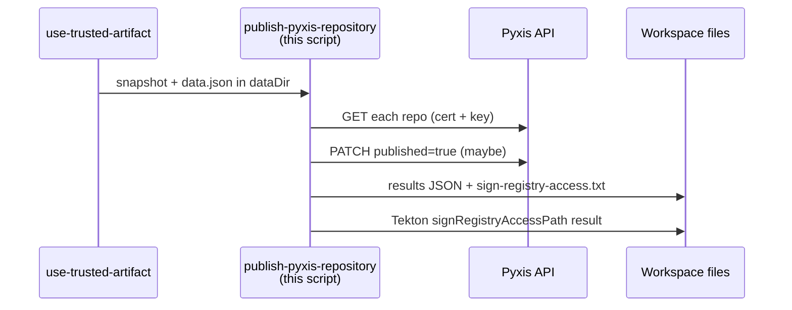

# publish_pyxis_repository.py

Marks container repositories as **published** in Pyxis, records Red Hat **catalog URLs**, and builds the **sign-registry-access** list for later signing steps.

Source: [`publish_pyxis_repository.py`](https://github.com/konflux-ci/release-service-utils/blob/main/scripts/python/tasks/managed/publish_pyxis_repository.py)

**Read this first:** Unlike internal OSIDB tasks, this script **fails the Tekton step** on error — [`main`](https://github.com/konflux-ci/release-service-utils/blob/main/scripts/python/tasks/managed/publish_pyxis_repository.py) raises `SystemExit` with a `publish_pyxis_repository.py: …` message (or `must be set` from missing env). There is no `result: Success` file.

Logs are on **stderr** as `INFO:` / `WARNING:` / `ERROR:` ([`logger`](https://github.com/konflux-ci/release-service-utils/blob/main/scripts/python/helpers/logger.py)).

---

## Where this runs

Catalog task [`publish-pyxis-repository`](https://github.com/konflux-ci/release-service-catalog/blob/development/tasks/managed/publish-pyxis-repository/publish-pyxis-repository.yaml) runs as a **normal Tekton step** (not an InternalRequest) in:

| Pipeline | Notes |
|----------|-------|
| [`rh-push-to-registry-redhat-io`](https://github.com/konflux-ci/release-service-catalog/blob/development/pipelines/managed/rh-push-to-registry-redhat-io/rh-push-to-registry-redhat-io.yaml) | After `apply-mapping` / `collect-data` |
| [`rh-advisories`](https://github.com/konflux-ci/release-service-catalog/blob/development/pipelines/managed/rh-advisories/rh-advisories.yaml) | **Skipped** when `filter-already-released-advisory-images` sets `skip_release=true` |
| [`rh-push-helm-chart-to-registry-redhat-io`](https://github.com/konflux-ci/release-service-catalog/blob/development/pipelines/managed/rh-push-helm-chart-to-registry-redhat-io/rh-push-helm-chart-to-registry-redhat-io.yaml) | Same pattern |

Typical inputs come from **`collect-data`** (`snapshotPath`, `dataPath`, `resultsDirPath`) and **`collect-task-params`** (`server`, `pyxisSecret`).

---

## Inputs and outputs

### Reads

| Input | Path / source |
|-------|----------------|
| Snapshot | `PARAM_DATA_DIR` / `PARAM_SNAPSHOT_PATH` — `components[].repositories[].url` (Quay URLs from mapping) |
| Data JSON | `PARAM_DATA_DIR` / `PARAM_DATA_PATH` — `pyxis.skipRepoPublishing`, `mapping.defaults.pushSourceContainer` |
| Pyxis login | Kubernetes secret mounted at `PYXIS_SECRET_MOUNT` (default `/etc/secrets`) — two files: `cert` and `key`. The script passes both to every Pyxis HTTP call ([`cert` tuple](https://github.com/konflux-ci/release-service-utils/blob/main/scripts/python/tasks/managed/publish_pyxis_repository.py)). |
| Pyxis environment | `PARAM_SERVER` → API base URL ([`pyxis_api_url_for_server`](https://github.com/konflux-ci/release-service-utils/blob/main/scripts/python/helpers/pyxis_api.py)); optional test override `PYXIS_URL` |

### Quay URL → Pyxis mapping

| Quay prefix | Pyxis registry | Repository name |
|-------------|----------------|-----------------|
| `quay.io/redhat-prod/…`, `quay.io/redhat-pending/…` | `registry.access.redhat.com` | last path segment with `----` → `/` ([`pyxis_repository_from_quay_url`](https://github.com/konflux-ci/release-service-utils/blob/main/scripts/python/helpers/pyxis_api.py)) |
| `quay.io/rh-flatpaks-prod/…`, `quay.io/rh-flatpaks-stage/…` | `flatpaks.registry.redhat.io` | same `----` rule |

### Writes

| Output | Location |
|--------|----------|
| Catalog URL list | `{dataDir}/{resultsDirPath}/publish-pyxis-repository-results.json` — `{"catalog_urls": [{"name", "url"}, …]}` |
| Sign list | `{dataDir}/{dirname(dataPath)}/sign-registry-access.txt` — one Pyxis repo per line (e.g. `my-product/my-image`) |
| Tekton result | `signRegistryAccessPath` — **relative** path to that txt file from `dataDir` ([`publish_pyxis_repository.py`](https://github.com/konflux-ci/release-service-utils/blob/main/scripts/python/tasks/managed/publish_pyxis_repository.py)) |

Downstream **`rh-sign-image`** / **`rh-sign-image-cosign`** read `signRegistryAccessPath`. An empty sign file is normal when no repo qualifies.

### Tekton env (Python step)

| Env | Role |
|-----|------|
| `PARAM_DATA_DIR` | Workspace root |
| `PARAM_SNAPSHOT_PATH` | Relative snapshot JSON |
| `PARAM_DATA_PATH` | Relative `data.json` |
| `PARAM_RESULTS_DIR_PATH` | Relative results directory |
| `PARAM_SERVER` | `production`, `stage`, `production-internal`, or `stage-internal` |
| `RESULT_SIGN_REGISTRY_ACCESS_PATH` | Path to write Tekton `signRegistryAccessPath` |
| `PYXIS_SECRET_MOUNT` | Cert directory |
| `TASK_NAME` | Label in logs (from `context.task.name`) |
| `PYXIS_URL` | Optional override (tests/mocks; not set in production pipelines) |

---

## Publish rules

For each `repositories[].url` on each snapshot component:

1. **GET** Pyxis repository JSON ([`get_repository_json`](https://github.com/konflux-ci/release-service-utils/blob/main/scripts/python/helpers/pyxis_api.py)) — needs `_id`.
2. **Sign list:** if registry is `registry.access.redhat.com` and Pyxis `requires_terms` is **`false`** (JSON boolean), append `pyxis_repo` to `sign-registry-access.txt` — see [`should_add_sign_registry_access`](https://github.com/konflux-ci/release-service-utils/blob/main/scripts/python/tasks/managed/publish_pyxis_repository.py). (Catalog YAML text says `requires_terms=true`; the **code** uses `false`. Flatpak registries never qualify.)
3. **PATCH** only when:
   - `data.pyxis.skipRepoPublishing` is not true ([`skip_repo_publishing`](https://github.com/konflux-ci/release-service-utils/blob/main/scripts/python/tasks/managed/publish_pyxis_repository.py)), **and**
   - Pyxis `publish_on_push` is **exactly** `true`.
4. PATCH body: `published: true`, plus `source_container_image_enabled: true` when [`component_push_source_container`](https://github.com/konflux-ci/release-service-utils/blob/main/scripts/python/helpers/snapshot.py) is true (default from `mapping.defaults.pushSourceContainer`, default **true**).

`publish_on_push = false` or `skipRepoPublishing` → **WARNING** or INFO skip lines; step can still **succeed** with `0 published`.

---

## What each part of the code does

### [`main`](https://github.com/konflux-ci/release-service-utils/blob/main/scripts/python/tasks/managed/publish_pyxis_repository.py)

Loads required env and paths, calls [`run_publish_pyxis_repository`](https://github.com/konflux-ci/release-service-utils/blob/main/scripts/python/tasks/managed/publish_pyxis_repository.py). On `FileNotFoundError`, `ValueError`, `OSError`, or any other exception → `SystemExit(f"{PROG}: {exc}")`. Success → return `0`.

### [`run_publish_pyxis_repository`](https://github.com/konflux-ci/release-service-utils/blob/main/scripts/python/tasks/managed/publish_pyxis_repository.py)

1. Verifies snapshot and data files exist.
2. Writes Tekton `signRegistryAccessPath` and creates empty `sign-registry-access.txt` beside `data.json`.
3. Logs start, Pyxis URL ([`resolve_pyxis_api_url`](https://github.com/konflux-ci/release-service-utils/blob/main/scripts/python/tasks/managed/publish_pyxis_repository.py)), skip flag, default `pushSourceContainer`.
4. Calls [`publish_repositories`](https://github.com/konflux-ci/release-service-utils/blob/main/scripts/python/tasks/managed/publish_pyxis_repository.py).
5. Writes [`publish-pyxis-repository-results.json`](https://github.com/konflux-ci/release-service-utils/blob/main/scripts/python/tasks/managed/publish_pyxis_repository.py).
6. Logs completion with published count.

### [`publish_repositories`](https://github.com/konflux-ci/release-service-utils/blob/main/scripts/python/tasks/managed/publish_pyxis_repository.py)

Loops snapshot `components` → `repositories`:

- Maps Quay URL to Pyxis registry/repo; logs `Processing repository … as Pyxis …`.
- GET → requires `_id` or logs `ERROR: Pyxis response for …` and raises.
- Maybe appends sign-list line; maybe PATCH and append to `catalog_urls` via [`catalog_url_for_repository`](https://github.com/konflux-ci/release-service-utils/blob/main/scripts/python/helpers/pyxis_api.py).

### Small helpers

| Function | Role |
|----------|------|
| [`build_publish_payload`](https://github.com/konflux-ci/release-service-utils/blob/main/scripts/python/tasks/managed/publish_pyxis_repository.py) | PATCH JSON |
| [`resolve_pyxis_api_url`](https://github.com/konflux-ci/release-service-utils/blob/main/scripts/python/tasks/managed/publish_pyxis_repository.py) | `PYXIS_URL` or `PARAM_SERVER` map |
| [`skip_repo_publishing`](https://github.com/konflux-ci/release-service-utils/blob/main/scripts/python/tasks/managed/publish_pyxis_repository.py) | Reads `pyxis.skipRepoPublishing` |

Pyxis HTTP: GET uses 120s timeout and returns error bodies ([`allow_error_status=True`](https://github.com/konflux-ci/release-service-utils/blob/main/scripts/python/helpers/pyxis_api.py)); PATCH raises on non-2xx.

---

## Troubleshooting

Open the **`publish-pyxis-repository`** step log (not `use-trusted-artifact` / `create-trusted-artifact`).

**Succeeded** with `WARNING:` or `0 published` can be normal. **Failed** means non-zero exit — read the last `INFO:`/`WARNING:`/`ERROR:` lines and the exit message.

### By last stderr log line

| Last log line | Step | Likely issue | What to check |
|---------------|------|--------------|---------------|
| *(no `INFO:` lines)* | Failed | Missing env before work starts | stderr for `PARAM_* must be set` or `RESULT_SIGN_REGISTRY_ACCESS_PATH must be set`; [catalog task env](https://github.com/konflux-ci/release-service-catalog/blob/development/tasks/managed/publish-pyxis-repository/publish-pyxis-repository.yaml) |
| `INFO: Beginning "…" for "…"` then fail | Failed | Missing snapshot or data file | Paths under `PARAM_DATA_DIR`; upstream `collect-data` / trusted artifact |
| `INFO: Using Pyxis API URL: …` then immediate fail | Failed | Bad `PARAM_SERVER` | `Invalid server parameter` in exit text; `collect-task-params` server value |
| `INFO: Processing repository … as Pyxis …` (long pause) | Failed | Pyxis GET slow/down (~120s timeout) | Pyxis health; `cert` and `key` in `pyxisSecret` mount |
| `ERROR: Pyxis response for …` (last line) | Failed | GET body without `_id` | Full JSON in log; repo exists in Pyxis for that registry/name and environment |
| `INFO: Found Pyxis repository id …` then fail before `Published` | Failed | Catalog URL prefix or PATCH | `Unknown repository prefix` (unsupported Quay URL); or `Pyxis PATCH failed` in exit message |
| `WARNING: repository … publish_on_push = false` | **Succeeded** (often) | Pyxis repo not set to publish-on-push | Expected skip; fix Pyxis config if publish was intended |
| `INFO: skipRepoPublishing is set to true, skipping publishing…` | **Succeeded** (often) | `data.json` has `pyxis.skipRepoPublishing: true` | Release data intent |
| `INFO: Published …` on some repos, then fail | Failed | Later GET or PATCH error | Exit message tail; cert; repository id |
| `INFO: Completed "…" for "…": N published, results in …` | **Succeeded** | — | Verify `publish-pyxis-repository-results.json` and `signRegistryAccessPath` |

### By step exit message

| Exit text contains | Likely issue |
|--------------------|--------------|
| `must be set` | Tekton env not wired to the Python step |
| `No valid snapshot file was provided` | Bad/missing `PARAM_SNAPSHOT_PATH` |
| `No data JSON was provided` | Bad/missing `PARAM_DATA_PATH` |
| `Invalid server parameter` | `server` param not one of four allowed values |
| `snapshot components must be a JSON array` | Corrupt snapshot JSON |
| `Unable to get Container Repository object id from Pyxis` | Pyxis GET missing `_id` (see `ERROR:` log) |
| `Unknown repository prefix` | Quay URL not in prod/stage catalog prefix lists |
| `invalid JSON from Pyxis GET` | Non-JSON GET response |
| `Pyxis PATCH failed for` | PATCH HTTP error (status + body in message) |
| Connection / timeout text | Network or Pyxis outage |

### This script did not run

| Situation | Meaning |
|-----------|---------|
| `rh-advisories` and `skip_release=true` | Task skipped by pipeline `when` — not a Pyxis failure |
| No `publish-pyxis-repository` step in TaskRun | Different pipeline or conditional skip |

---

## Tests and related files

| Item | Link |
|------|------|
| Unit tests | [`test_publish_pyxis_repository.py`](https://github.com/konflux-ci/release-service-utils/blob/main/scripts/python/tasks/managed/test_publish_pyxis_repository.py) |
| Catalog task test | [`test-publish-pyxis-repository.yaml`](https://github.com/konflux-ci/release-service-catalog/blob/development/tasks/managed/publish-pyxis-repository/tests/test-publish-pyxis-repository.yaml) |
| Pyxis helpers | [`pyxis_api.py`](https://github.com/konflux-ci/release-service-utils/blob/main/scripts/python/helpers/pyxis_api.py) |
| Snapshot helpers | [`snapshot.py`](https://github.com/konflux-ci/release-service-utils/blob/main/scripts/python/helpers/snapshot.py) |
